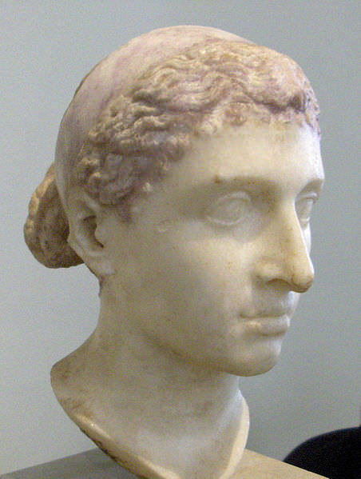

# Cleopatra Project - December 2018

## Daniel Willow (Year 4)

# Marrige
Amazingly, she married 2 of her brothers and only had one son!

# Birth And Death
Cleopatra was born at Alexandria in Egypt 69BC (she was a Greek!). Her family had ruled for over 249 years!! 
Then, sadly she died with the help of an asp in 30BC.

# Alexandria 
Alexandria was a center for learning. It had the largest library in the world. There were over 1000 scrolls in over 100 languages.

This marble statue is believed to be Cleopatra. Her full name was Cleopatra VII Thea Philopator.

<!-- dont put anything below here -->

